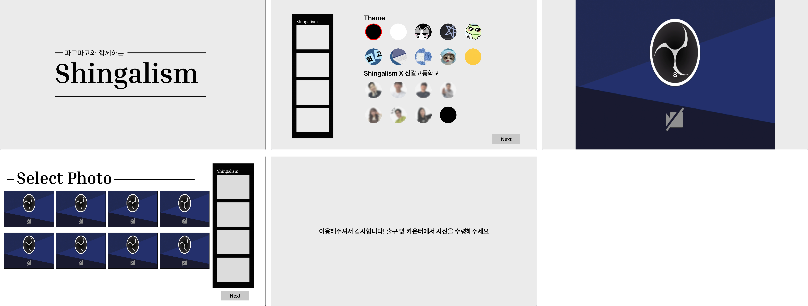

# shingalism
신갈고등학교 2025 가은제(축제) 때 사용한 신갈이즘 프로그램입니다. 
제작 완료 : 2025.11.03

'포토이즘'이라는 셀프 사진 촬영 포토 부스 브랜드의 소프트웨어를 모티브로 제작하였으며,
포토이즘 연예인 프레임에서 아이디어를 얻어 교사 7분의 프레임을 제작, 적용하여 자체적으로 촬영할 수 있도록 만들었습니다.
pygame, opencv로 주요 기능을 구현하였으며, google api를 활용하여 자동으로 google drive에 촬영한 이미지가 전송되도록 구현하였습니다.(프린터로 즉시 출력 또한 함수로 구현되어있음.) 

깃허브 업로드를 위해 기존 비공개 레포지토리를 복제하여 교직원이 포함된 이미지, api key등이 삭제되거나 대체된 레포지토리로, 수정하지 않을시 일부 기능은 작동하지 않을 수 있습니다.
또한 몇차례 수정이 있어 다량의 코드가 주석처리되었으니 참고바랍니다.

화면구성은 다음과 같습니다.

<b>홈</b> 
촬영대기 화면으로 스페이스바를 누르면 다음 화면으로 넘어갑니다.

<b>프레임 선택</b> 
우측 이미지가 삽입된 원을 클릭할 경우 촤측에 배치된 프레임 이미지가 변경됩니다.  이를 통해 원하는 프레임을 선택할 수 있습니다.
선택이 완료된 경우 next버튼을 눌러 다음 화면으로 넘어갑니다.

<b>사진 촬영</b> 
화면 중앙에 카메라가 표시되며, 10초 카운트다운이 시작됩니다. 총 8장을 촬영하며, 스페이스바 버튼을 누르면 시간을 스킵할 수 있습니다.

<b>사진 선택</b> 
촬영된 사진이 좌측에 배열되며, 클릭할 경우 우측 미리보기 프레임에 적용되어 즉시 확인해볼 수 있습니다.  우측 미리보기 프레임에는 앞서 선택한 프레임 이미지로 표시됩니다.

<b>종료 안내 화면</b> 
사진 촬영이 완료되면 선택한 이미지와 프레임을 편집하여 완성된 사진을 출력하거나 google drive로 전송합니다.

카메라는 비활성화된 상태이기에 obs로고가 표기됩니다. 
교직원 이미지가 포함된 이미지는 블러처리되었습니다.
